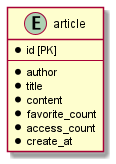

# team1_main
## 設計

## 導入
* 以下を参考にSQLのセットアップ(※[]内を任意のものに変更してください)

```setup.sql
CREATE DATABASE IF NOT EXISTS [team1_main_db];
CREATE USER  IF NOT EXISTS [db_user_name]@localhost IDENTIFIED BY "[your_password]";
GRANT SELECT,UPDATE,INSERT,DELETE ON [team1_main_db].* TO [db_user_name]@localhost;

USE [team1_main_db];
DROP TABLE IF EXISTS content;
CREATE TABLE article(
    id INT AUTO_INCREMENT PRIMARY KEY, 
    author TEXT NOT NULL,
    title TEXT NOT NULL,
    content TEXT NOT NULL, 
    favorite_count INT NOT NULL DEFAULT 0,
    access_count INT NOT NULL DEFAULT 0, 
    create_at DATETIME NOT NULL DEFAULT CURRENT_TIMESTAMP
);

INSERT INTO article(author,title,content) VALUES("mizuno","What is this","This is a pen"); 
```

* ログイン用ユーザ情報テーブル
```
DROP TABLE IF EXISTS login_user;
CREATE TABLE login_user(
		id INT AUTO_INCREMENT PRIMARY KEY,
		username TEXT NOT NULL,
		password VARCHAR(20) NOT NULL
);

INSERT INTO login_user(username, `password`) values("testuser", "testpass");
```

* application.propertiesを下記を参考に変更(※[]内を任意のものに変更してください)

```application.properties
spring.datasource.url=jdbc:mysql://localhost:3306/[DBの名前]?characterEncoding=UTF-8
spring.datasource.username=[DBユーザーの名前]
spring.datasource.password=[DBユーザーのパスワード]
spring.datasource.driver-class-name=com.mysql.cj.jdbc.Driver
```
